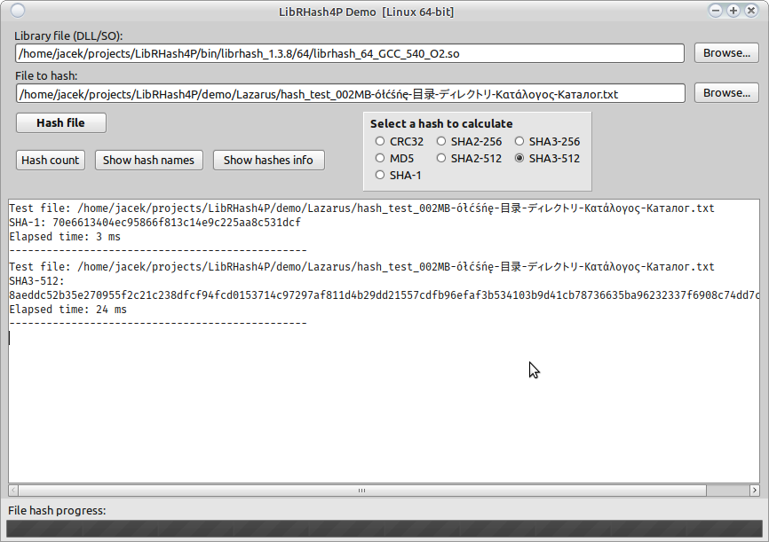
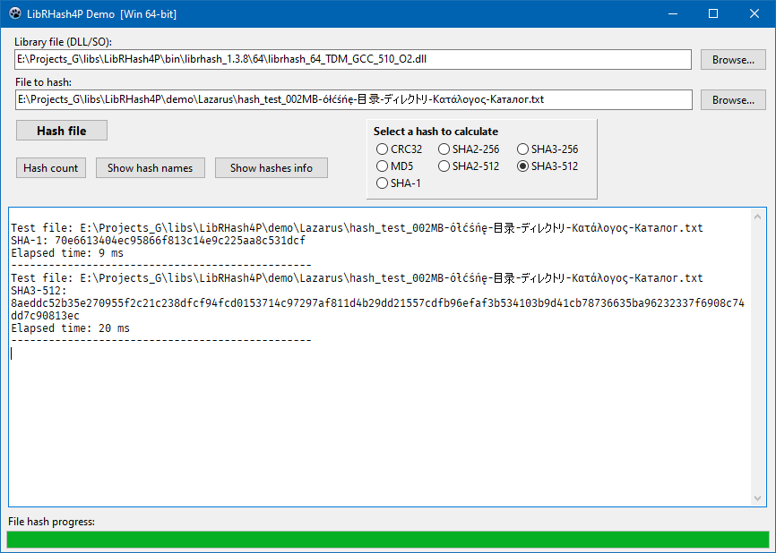


# LibRHash4P

LibRHash for Pascal (Lazarus + Delphi).

<https://github.com/rhash/RHash>

## DLL / SO

The **bin** directory contains compiled libraries for Linux and Windows.

## Screenshots

Demo application on Linux

---

Demo application on Windows

## Changelog

09.12.2019  
Initial release for RHash ver. 1.3.8
